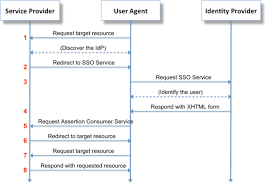
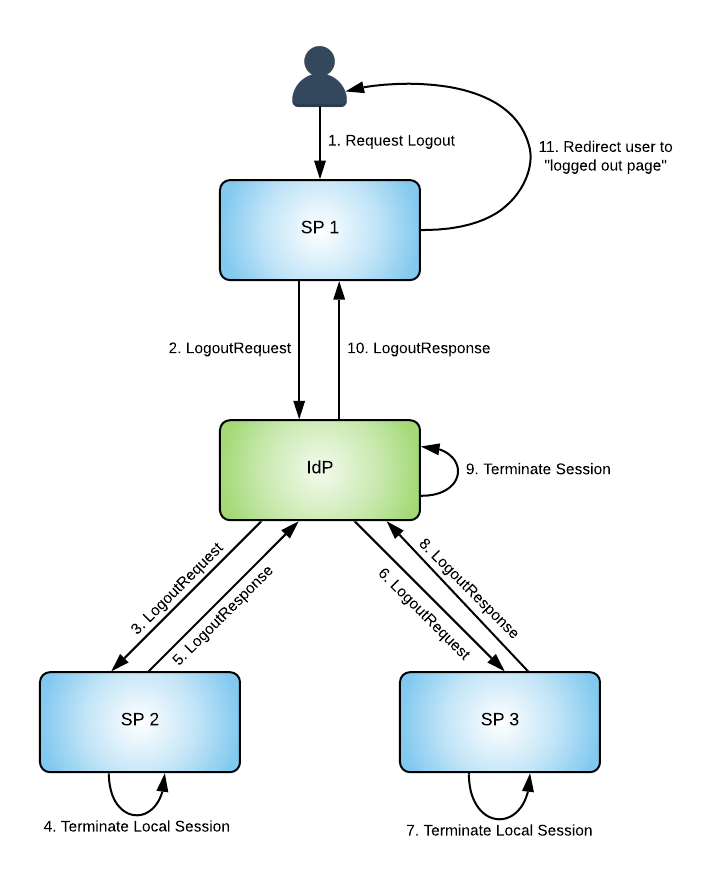

# Configuration

To see a complete example of a working config file: head to [`badaas.example.yml`](./badaas.example.yml)

As said in the README:

> Badaas can be configured using environment variables, CLI flags or a configuration file.
> CLI flags take priority on the environment variables and the environment variables take priority on the content of the configuration file.

In this documentation file, we will mainly focus our attention on config files but we won't forget that we can use environement variables and CLI flags to change Badaas' config.

The config file can be formated in any syntax that [github.com/spf13/viper](https://github.com/spf13/viper) supports but we will only use YAML syntax in our docs.

- [Configuration](#configuration)
  - [Database](#database)
  - [Logger](#logger)
  - [HTTP Server](#http-server)
  - [Default values](#default-values)
  - [Session management](#session-management)
  - [Authentication](#authentication)
    - [OIDC](#oidc)

## Database

We use CockroachDB as a database. It is Postgres compatible, so the information we need to provide will not be a surprise to Postgres users.

```yml
# The settings for the database.
database:
  # The host of the database server. 
  # (mandatory)
  host: e2e-db-1

  # The port of the database server. 
  # (mandatory)
  port: 26257

  # The sslmode of the connection to the database server. 
  # (mandatory)
  sslmode: disable

  # The username of the account on the database server. 
  # (mandatory)
  username: root

  # The password of the account on the database server.
  # (mandatory)
  password: postgres

  # The settings for the initialization of the database server. 
  init:
    # Number of time badaas will try to establish a connection to the database server.
    # default (10)
    retry: 10

    # Waiting time between connection, in seconds.
    # default (5)
    retryTime: 5
```

Please note that the init section `init:` is not mandatory. Badaas is suited with a simple but effective retry mecanism that will retry `database.init.retry` time to establish a connection with the database. Badaas will wait `database.init.retryTime` seconds between each retry.

## Logger

Badaas use a structured logger that can output json logs in production and user adapted logs for debug using the `logger.mode` key.  

Badaas offers the possibility to change the log message of the Middleware Logger but provides a sane default. It is formated using the Jinja syntax. The values available are `method`, `url` and `protocol`.

```yml
# The settings for the logger.
logger:
  # Either `dev` or `prod`
  # default (`prod`)
  mode: prod
  request:
    # Change the log emitted when badaas receives a request on a valid endpoint.
    template: "Receive {{method}} request on {{url}}"
```

## HTTP Server

You can change the host Badaas will bind to, the port and the timeout in seconds.

Additionaly you can change the number of elements returned by default for a paginated response.

```yml
# The settings for the http server.
server:
  # The address to bind badaas to.
  # default ("0.0.0.0")
  host: "" 

  # The port badaas should use.
  # default (8000)
  port: 8000

  # The maximum timeout for the http server in seconds.
  # default (15)
  timeout: 15 

  # The settings for the pagination.
  pagination:
    page:
      # The maximum number of record per page 
      # default (100)
      max: 100
```

## Default values

The section allow to change some settings for the first run.

```yml
# The settings for the first run.
default:
  # The admin settings for the first run
  admin:
    # The admin password for the first run. Won't change is the admin user already exists.
    password: admin
```

## Session management

You can change the way the session service handle user sessions.
Session are extended if the user made a request to badaas in the "roll duration". The session duration and the refresh interval of the cache can be changed. They contains some good defaults.

Please see the diagram below to see what is the roll duration relative to the session duration.

```txt
     |   session duration                        |
     |<----------------------------------------->|
 ----|-------------------------|-----------------|----> time
     |                         |                 |
                               |<--------------->|
                                  roll duration
```

```yml
# The settings for session service
# This section contains some good defaults, don't change thoses value unless you need to.
session:
  # The duration of a user session, in seconds
  # Default (14400) equal to 4 hours
  duration: 14400
  # The refresh interval in seconds. Badaas refresh it's internal session cache periodically.
  # Default (30)
  pullInterval: 30
  # The duration in which the user can renew it's session by making a request.
  # Default (3600) equal to 1 hour
  rollDuration: 3600
```

## Authentication

```yml
auth:
  type: plain
```

Enable by configuration type of authentification you want to use:

- `plain`: Only email/password auth
- `oidc`: OIDC auth
- `saml`: SAML auth
### OIDC

To enable OIDC based authentication, you have to provide some common values such as your Oauth2 ClientID, Client Secret and the issuer url.

The redirect url should probably be set to a url on your front-end app, then the front-end will return the authentication code to Badaas.

Usualy, users are uniquely identified by the "sub" claim on the ID Token or on the claims for the OIDC UserInfo endpoint. Badaas can use another claim if you need to identify users based on that other claim. Note that it should be changed if you EXPLICITLY need to change the identifying claim. That claim may be protected by a scope, you can make badaas ask for that scope by using `auth.oidc.scopes` (use comma separated values).

```yml
auth:
  type: oidc # please note that the key auth.type is set to "oidc"
  oidc:
    # The Oauth2.0 Client ID
    # (mandatory)
    clientID: oidcCLIENT

    # The Oauth2 Client Secret
    # (mandatory)
    clientSecret: abcd

    # The issuer URL
    # (mandatory)
    issuer: "http://accounts.super-company.com"

    # The redirect url. Use after the OIDC provider has authenticated the user. 
    # Probably should be set to redirect to the SPA. 
    # (mandatory)
    redirectURL: "http://super-spa.com/auth/oidc/callback"

    # The UNIQUE id claim used to identify OIDC users. 
    # Default to "sub", should not be changed unless you know what you are doing.
    claimIdentifier: email

    # The scopes needed to get the claims. 
    # Defaults to "", should not be changed unless you know what you are doing.
    scopes: "profile,email"
```
- `saml`: SAML auth

### SAML

**SAML**, which stands for **Security Assertion Markup Language**, is a technology used for enabling secure authentication and authorization between different online services or applications called **Service Provider (SP)**.**SAML** helps you avoid creating separate usernames and passwords for each of them. Instead, it lets you use the credentials from one trusted place called an **identity provider** (IdP) to access multiple services. 

#### Authentication



Badaas can handle two different bindings for authentication as a SP : *HTTP-Redirect* and *HTTP-POST*. **Please note that the IdP has to use the HTTP-POST Binding to send the assertion to the SP even for the logout**
 
Both *HTTP-Redirect* and *HTTP-POST* bindings have their advantages and disadvantages. *HTTP-Redirect* is simpler and more cacheable, but it has limitations in terms of data size and potential exposure of sensitive information. *HTTP-POST* provides better data privacy and can handle larger payloads, but it's slightly more complex to implement and might be resource-intensive. The choice between the two will depend on the specific requirements of the authentication flow and the trade-offs that best suit the application's needs. 

#### Log out

Logging out with SAML involves securely ending your session across multiple connected websites or services. It's like making sure you're properly signed out from all your accounts when you're done using them. 



#### Setting 

You have to download the metadata of your IdP and upload the metadata of your SP on the website of the IdP in order to begin the handshake by sharing the public key of both SP and IdP. You can download the SP's metadata by going to the page http://yoursite/auth/saml/metadata or  http://yoursite/auth/saml/metadataslo if you want to implement the logout.
 
Please note that sometimes you will need to remove the decimals from the variable "validUntil" in the SP's metadata.


```yml
auth:
 saml:
  #Time of validity of the SP metadata (unit hour) Note that sometimes y
  TimeValiditySPMetadata: 168

  # Path where the IdP's metadata is stored 
  IdpMetadataFullPath: /FullPathWhere/idpMetadata
  
  # Type of binding use for the authentication HTTP-Redirect or HTTP-POST
  SAMLSPSSOBindingKey : HTTP-Redirect

  # The name of your website
  DomaineName: http://mydomaine

  # Boolean value you should be always equals to true
  SignAuthnRequests: true

  # If set to true the user will has to log in every time on the idp 
  ForceAuthn: false


  # Full path for the Private and Public Key

  SPkeyPath: /FullPathSPKey/myservice.key
  SPCertifPath: /FullPathSPCert/myservice.cert

   
```
