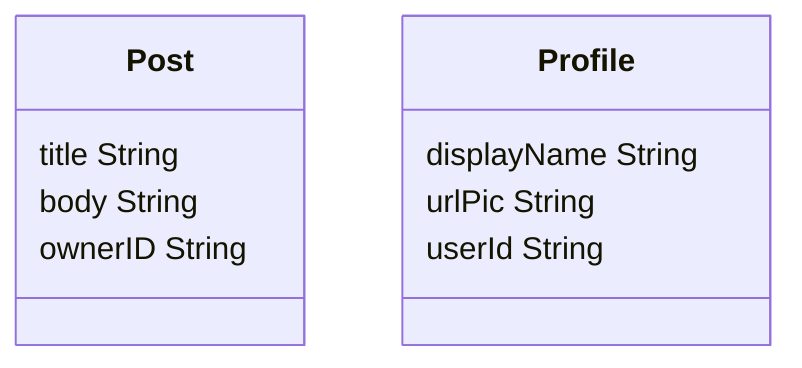

# Demoing badaas authentication and object storage

## Setting up

First we need to setup the database connection. (Please head to the `configuration.md` page to learn more.)
The minimal configuration for the database looks like this:

```yml
# The settings for the database.
database:
  # The host of the database server. 
  # (mandatory)
  host: <insert value>

  # The port of the database server. 
  # (mandatory)
  port: <insert value>

  # The sslmode of the connection to the database server. 
  # (mandatory)
  sslmode: <insert value>

  # The username of the account on the database server. 
  # (mandatory)
  username: <insert value>

  # The password of the account on the database server.
  # (mandatory)
  password: <insert value>
```

Then we need to declare our models for the objects.
As an example we will use some UML to model the objects for this demo.



The users are stored on a classic sql table outside of the object storage engine.
So we will store their IDs as a value. We will use the profile object to store infos about the users.

For now we need to setup the schema manually using a invoke function that will run at the initialization of the programme.
Make sure that the database you are gonna use is empty.

```go
func PopulateDatabase2(db *gorm.DB) error {
 // GETTING THE USER ADMIN FOR REFERENCE
 var admin models.User
 err := db.First(&admin, "username = ?", "admin").Error
 if err != nil {
  return err
 }

 // CREATION OF THE PROFILE TYPE AND ASSOCIATED ATTRIBUTES
 ProfileType := &models.EntityType{
  Name: "profile",
 }
 displayNameAttr := &models.Attribute{
  EntityTypeId: ProfileType.ID,
  Name:         "displayName",
  ValueType:    "string",
  Required:     true,
 }
 urlPicAttr := &models.Attribute{
  EntityTypeId:  ProfileType.ID,
  Name:          "urlPic",
  ValueType:     "string",
  Required:      false,
  Default:       true,
  DefaultString: "https://www.startpage.com/av/proxy-image?piurl=https%3A%2F%2Fimg.favpng.com%2F17%2F19%2F1%2Fbusiness-google-account-organization-service-png-favpng-sUuKmS4aDNRzxDKx8kJciXdFp.jpg&sp=1672915826Tc106d9b5cab08d9d380ce6fdc9564b199a49e494a069e1923c21aa202ba3ed73",
 }
 userIdAttr := &models.Attribute{
  EntityTypeId: ProfileType.ID,
  Name:         "userId",
  ValueType:    "string",
  Required:     true,
 }
 ProfileType.Attributes = append(ProfileType.Attributes,
  displayNameAttr,
  urlPicAttr,
  userIdAttr,
 )

 // INSTANTIATION OF A Profile
 adminProfile := &models.Entity{
  EntityTypeId: ProfileType.ID,
  EntityType:   ProfileType,
 }
 displayNameVal := &models.Value{Attribute: urlPicAttr, StringVal: "The Super Admin"}
 userPicVal := &models.Value{Attribute: urlPicAttr, IsNull: true}
 userIdVal := &models.Value{Attribute: userIdAttr, StringVal: admin.ID.String()}
 adminProfile.Fields = append(adminProfile.Fields,
  displayNameVal,
  userPicVal,
  userIdVal,
 )

 // CREATION OF THE POST TYPE AND ASSOCIATED ATTRIBUTES
 PostType := &models.EntityType{
  Name: "post",
 }
 titleAttr := &models.Attribute{
  EntityTypeId: PostType.ID,
  Name:         "title",
  ValueType:    "string",
  Required:     true,
 }
 bodyAttr := &models.Attribute{
  Name:          "body",
  ValueType:     "string",
  Default:       false,
  DefaultString: "empty",
 }
 ownerAttr := &models.Attribute{
  Name:      "ownerID",
  ValueType: "string",
  Required:  true,
 }

 PostType.Attributes = append(
  PostType.Attributes, titleAttr, bodyAttr, ownerAttr,
 )
 // INSTANTIATION OF A POST
 whycatslikemice := &models.Entity{
  EntityTypeId: PostType.ID,
  EntityType:   PostType,
 }
 titleVal := &models.Value{
  Attribute:  titleAttr,
  StringVal: "Why cats like mice ?",
 }
 bodyVal, err := models.NewStringValue(bodyAttr,
  `Lorem ipsum dolor sit amet, consectetur adipiscing elit. In consectetur, ex at hendrerit lobortis, tellus lorem blandit eros, vel ornare odio lorem eget nisi. In erat mi, pharetra ut lacinia at, facilisis vitae nunc. Fusce rhoncus id justo vitae gravida. In nisi mi, rutrum et arcu ac, gravida venenatis arcu. Nulla leo metus, molestie eu sagittis non, ultricies eu ex. Fusce a lorem eu urna porttitor molestie. Aliquam nec sapien quam. Suspendisse aliquet elementum arcu vitae interdum. Maecenas nec turpis et nulla volutpat accumsan. Pellentesque non ullamcorper leo, eu fringilla odio.
 
 Cras eu felis mauris. Pellentesque varius imperdiet suscipit. Nam tellus odio, faucibus at mattis quis, cursus at tortor. Curabitur vitae mi eu lorem feugiat pretium sed sit amet purus. Proin efficitur, magna eu malesuada fermentum, tortor tortor maximus neque, vel mattis tortor orci a ligula. Nunc nec justo ipsum. Sed fermentum, nisl eget efficitur accumsan, augue nisl sollicitudin massa, vel suscipit enim turpis nec nisi.
 
 Nam dictum risus sed leo malesuada varius. Pellentesque gravida interdum risus id vulputate. Mauris feugiat vulputate leo ut euismod. Fusce auctor at lacus eget sollicitudin. Suspendisse potenti. Aliquam dui felis, mollis quis porta a, sodales in ligula. In ac elit ornare, facilisis ex eget, tincidunt orci. Nullam eu mattis turpis, non finibus dolor.
 `)
 if err != nil {
  return err
 }
 ownerVal := &models.Value{
  Attribute:  ownerAttr,
  StringVal: admin.ID.String(),
 }

 whycatslikemice.Fields = append(whycatslikemice.Fields,
  titleVal, bodyVal, ownerVal,
 )

 err = db.Create(whycatslikemice).Error
 if err != nil {
  return err
 }

 err = db.Create(adminProfile).Error
 if err != nil {
  return err
 }

 fmt.Println("Finished populating the database")

 return nil
}
```

### Authentication

Currently we only support a basic authentication using an email and a password.
The default credentials for the user are ̀`admin-no-reply@badaas.com` and `admin` (The admin password can be changed on the first run through the config, please see [configuration.md](configuration.md)).

### Querying the object storage engine

I will use the httpie util in the examples below, but it works with curl or any similar tools.

Let's first start by get all the profiles: `http  localhost:8000/v1/objects/profile/`

```json
HTTP/1.1 200 OK
Content-Length: 226
Content-Type: application/json
Date: Thu, 05 Jan 2023 11:53:35 GMT

[
    {
        "attrs": {
            "urlPic": "The Super Admin",
            "userId": "wowasupercooluserID"
        },
        "createdAt": "2023-01-05T12:47:41.166796+01:00",
        "id": "67c5c6dc-b82d-4c2a-9ab8-f7847a732086",
        "type": "profile",
        "updatedAt": "2023-01-05T12:47:41.166796+01:00"
    }
]
```

Let's  all the posts posted by this user: `http localhost:8000/v1/objects/post/?ownerID=wowasupercooluserID`

```json
HTTP/1.1 200 OK
Content-Length: 1626
Content-Type: application/json
Date: Fri, 06 Jan 2023 08:20:33 GMT

[
    {
        "attrs": {
            "body": "Lorem ipsum dolor sit amet, consectetur adipiscing elit. In consectetur, ex at hendrerit lobortis, tellus lorem blandit eros, vel ornare odio lorem eget nisi. In erat mi, pharetra ut lacinia at, facilisis vitae nunc. Fusce rhoncus id justo vitae gravida. In nisi mi, rutrum et arcu ac, gravida venenatis arcu. Nulla leo metus, molestie eu sagittis non, ultricies eu ex. Fusce a lorem eu urna porttitor molestie. Aliquam nec sapien quam. Suspendisse aliquet elementum arcu vitae interdum. Maecenas nec turpis et nulla volutpat accumsan. Pellentesque non ullamcorper leo, eu fringilla odio.\n\t\n\tCras eu felis mauris. Pellentesque varius imperdiet suscipit. Nam tellus odio, faucibus at mattis quis, cursus at tortor. Curabitur vitae mi eu lorem feugiat pretium sed sit amet purus. Proin efficitur, magna eu malesuada fermentum, tortor tortor maximus neque, vel mattis tortor orci a ligula. Nunc nec justo ipsum. Sed fermentum, nisl eget efficitur accumsan, augue nisl sollicitudin massa, vel suscipit enim turpis nec nisi.\n\t\n\tNam dictum risus sed leo malesuada varius. Pellentesque gravida interdum risus id vulputate. Mauris feugiat vulputate leo ut euismod. Fusce auctor at lacus eget sollicitudin. Suspendisse potenti. Aliquam dui felis, mollis quis porta a, sodales in ligula. In ac elit ornare, facilisis ex eget, tincidunt orci. Nullam eu mattis turpis, non finibus dolor.\n\t",
            "ownerID": "wowasupercooluserID",
            "title": "Why cats like mice ?"
        },
        "createdAt": "2023-01-06T09:18:53.313565+01:00",
        "id": "68facfa6-fe77-479b-a64e-f26344393a31",
        "type": "post",
        "updatedAt": "2023-01-06T09:18:53.313565+01:00"
    }
]
```
