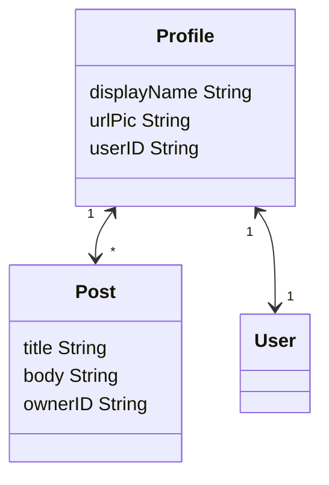

# Examples of BadAas authentication and object storage

## Options

There are two demos: `birds` ands `posts`. To run them exec `make example_birds` and `make example_posts` respectively.

## Set up

First we need to setup the database connection, the used configuration file is [here](../docker/api/badaas.yml). Please head to the [configuration doc](../configuration.md) page to learn more.
The minimal configuration for the database looks like this:

```yml
database:
  host: <insert value>
  port: <insert value>
  sslmode: <insert value>
  username: <insert value>
  password: <insert value>
  name: <insert value>
```

## Model definition

We need to declare our models for the objects.
As an example we will use some UML to model the objects for this demo.



The Users are stored on a classic sql table outside of the object storage engine (EAV), so the userID will be a value. We will use the Profile object to store info about the users.

For now we need to setup the schema manually using a invoke function that will run at the initialization of the programme. The definition can be found [here](examples.go#104)
Make sure that the database you are gonna use is empty.

## Authentication

Currently we only support a basic authentication using an email and a password.
The default credentials for the user are ̀`admin-no-reply@badaas.com` and `admin` (The admin password can be changed on the first run through the config, please see [configuration.md](configuration.md)).

## Test it

httpie util will be used in the examples below, but it works with curl or any similar tools.

Let's first start by getting all the profiles: `http localhost:8000/v1/objects/profile/`

```json
HTTP/1.1 200 OK
Content-Length: 226
Content-Type: application/json
Date: Thu, 05 Jan 2023 11:53:35 GMT

[
    {
        "attrs": {
            "urlPic": "The Super Admin",
            "userId": "wowASuperCoolUserID"
        },
        "createdAt": "2023-01-05T12:47:41.166796+01:00",
        "id": "67c5c6dc-b82d-4c2a-9ab8-f7847a732086",
        "type": "profile",
        "updatedAt": "2023-01-05T12:47:41.166796+01:00"
    }
]
```

Let's get all the posts posted by this user: `http localhost:8000/v1/objects/post/?ownerID=wowASuperCoolUserID`

```json
HTTP/1.1 200 OK
Content-Length: 1626
Content-Type: application/json
Date: Fri, 06 Jan 2023 08:20:33 GMT

[
    {
        "attrs": {
            "body": "Lorem ipsum dolor sit amet, consectetur adipiscing elit.\n\tIn consectetur, ex at hendrerit lobortis, tellus lorem blandit eros, vel ornare odio lorem eget nisi.\n\tIn erat mi, pharetra ut lacinia at, facilisis vitae nunc.\n\t",
            "ownerID": "wowasupercooluserID",
            "title": "Why cats like mice ?"
        },
        "createdAt": "2023-01-06T09:18:53.313565+01:00",
        "id": "68facfa6-fe77-479b-a64e-f26344393a31",
        "type": "post",
        "updatedAt": "2023-01-06T09:18:53.313565+01:00"
    }
]
```
